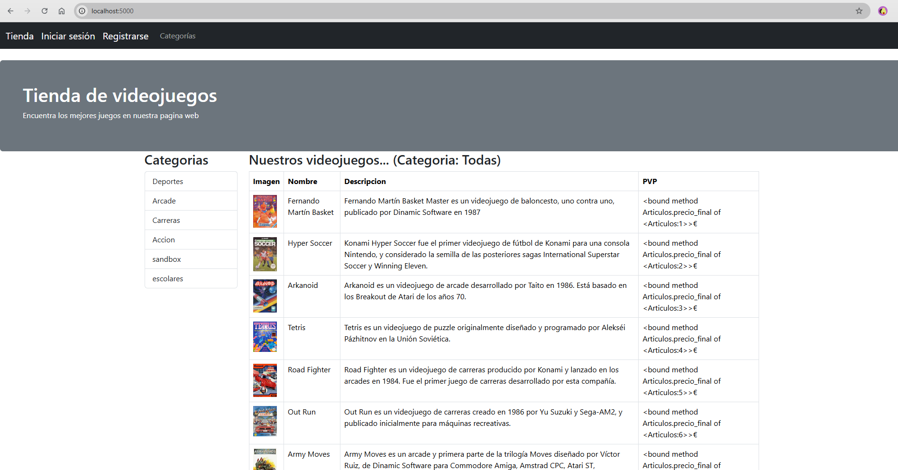
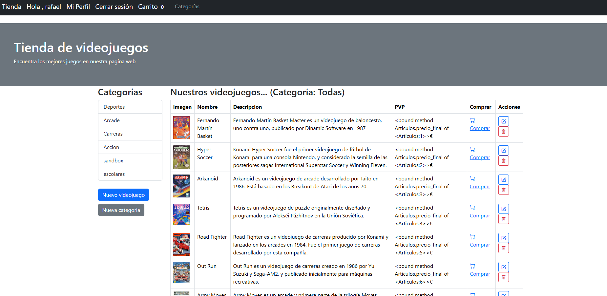
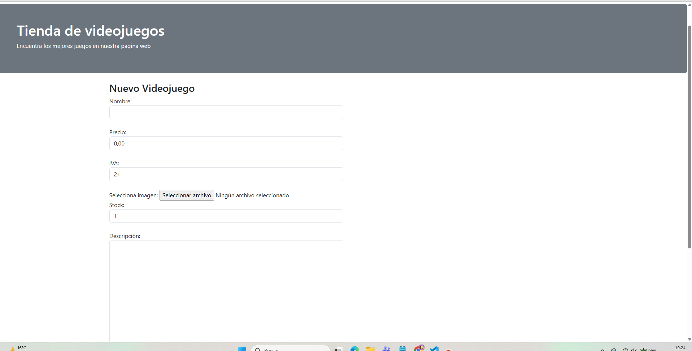
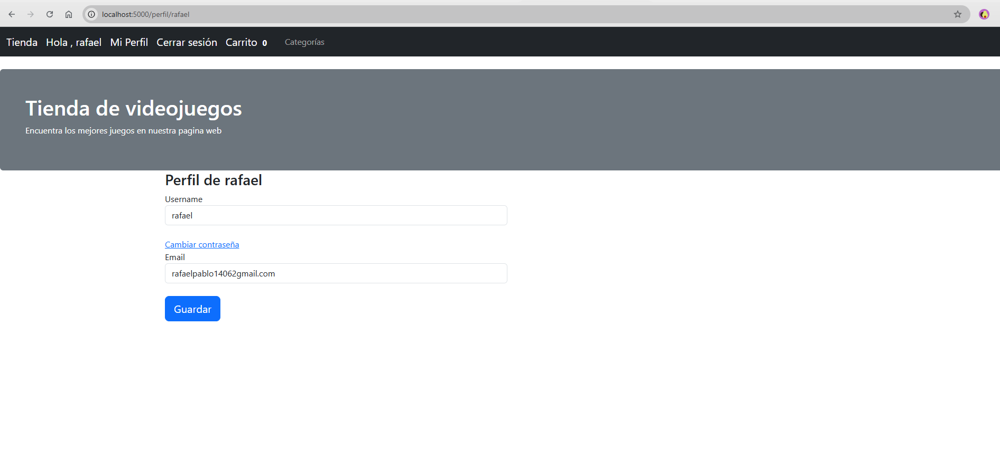
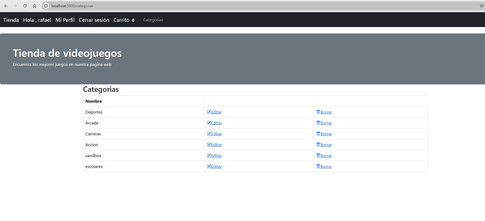
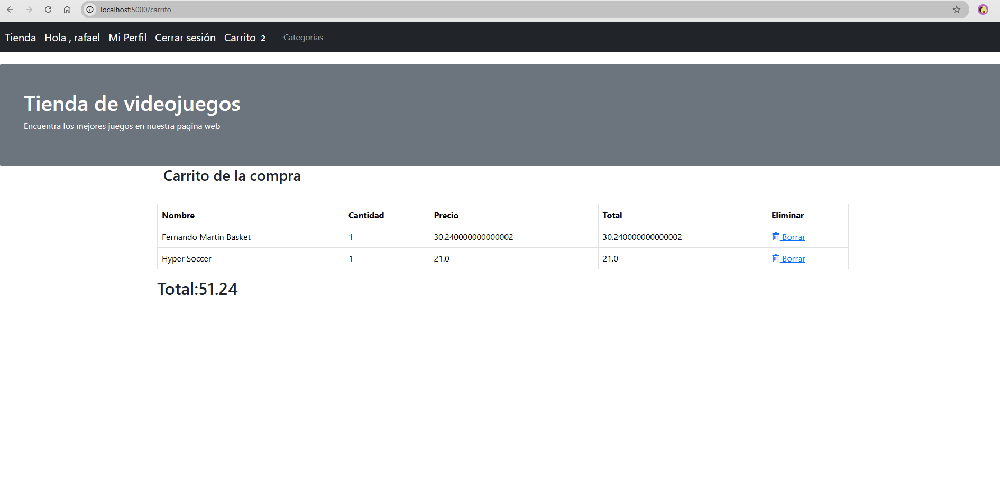

# Mini Tienda - Aplicación Flask

Una aplicación e-commerce desarrollada con **Flask** que permite gestionar una tienda online con categorías, artículos y usuarios con roles de administrador.

## 📋 Características

- ✅ **Gestión de Categorías**: Crear y organizar categorías de productos
- ✅ **Gestión de Artículos**: Agregar artículos con imagen, precio, stock e IVA
- ✅ **Autenticación de Usuarios**: Sistema de login/logout seguro con contraseñas cifradas
- ✅ **Roles y Permisos**: Distinción entre usuarios normales y administradores
- ✅ **Base de Datos SQLite**: Almacenamiento persistente de datos
- ✅ **Interfaz Responsiva**: Usando Bootstrap5 para diseño moderno
- ✅ **Gestión de Imágenes**: Subida y almacenamiento de imágenes de productos

## 🏗️ Arquitectura

### Estructura de Carpetas
```
mini-tienda/
├── app/
│   ├── __init__.py          # Inicialización de la app
│   ├── app.py               # Rutas principales y configuración
│   ├── config.py            # Configuración de la aplicación
│   ├── models.py            # Modelos de base de datos
│   ├── form.py              # Formularios WTF
│   ├── static/              # Archivos estáticos (CSS, imágenes)
│   └── templates/           # Plantillas HTML Jinja2
├── instance/                # Base de datos SQLite
├── entornoVirtual/          # Entorno virtual Python
├── manage.py                # Script para gestionar la app
├── requirements.txt         # Dependencias Python
└── README.md                # Este archivo
```

### Modelos de Datos

#### **Categorias**
```python
- id (Integer, PK)
- nombre (String)
- articulos (Relationship)
```

#### **Articulos**
```python
- id (Integer, PK)
- nombre (String)
- precio (Float)
- iva (Integer, default: 21%)
- descripcion (String)
- image (String - nombre del archivo)
- stock (Integer)
- categoria_id (FK -> Categorias)
```

#### **Usuarios**
```python
- id (Integer, PK)
- username (String)
- password_hash (String - cifrado)
- email (String)
- admin (Boolean, default: False)
```

## 🚀 Instalación y Configuración

### Requisitos Previos
- Python 3.8+
- pip (gestor de paquetes)

### Paso 1: Clonar y Navegar
```bash
cd mini-tienda
```

### Paso 2: Crear y Activar Entorno Virtual
```bash
# En Windows
python -m venv entornoVirtual
entornoVirtual\Scripts\activate

# En macOS/Linux
python3 -m venv entornoVirtual
source entornoVirtual/bin/activate
```

### Paso 3: Instalar Dependencias
```bash
pip install -r requirements.txt
```

### Paso 4: Inicializar la Base de Datos
```bash
python manage.py
```

## 💻 Ejecutar la Aplicación

```bash
python manage.py
```

La aplicación estará disponible en: **http://localhost:5000**

## 📦 Dependencias Principales

| Paquete | Versión | Descripción |
|---------|---------|-------------|
| Flask | 3.1.2 | Framework web |
| Flask-SQLAlchemy | 3.1.1 | ORM y gestión de BD |
| Flask-WTF | 1.2.2 | Manejo de formularios |
| Flask-Bootstrap | 3.3.7.1 | Bootstrap integrado |
| Flask-Login | (incluído en Flask) | Autenticación |
| SQLAlchemy | 2.0.46 | ORM |
| Werkzeug | 3.1.5 | Utilidades WSGI |

Ver `requirements.txt` para la lista completa.

## 🔐 Seguridad

- **Contraseñas Cifradas**: Usando `werkzeug.security` con hashing seguro
- **CSRF Protection**: Implementado a través de Flask-WTF
- **Session Management**: Con Flask-Login para autenticación segura
- **Validación de Formularios**: A través de WTForms

## � Capturas de Pantalla

La aplicación está completamente funcional. Aquí se muestran ejemplos visuales de su interfaz:

### Página de Inicio


### Catálogo de Productos


### Gestión de Categorías


### Agregar Nuevo Artículo


### Interfaz de Administrador


### Sistema de Autenticación


## �📝 Rutas Principales

| Ruta | Método | Descripción | Requiere Admin |
|------|--------|-------------|----------------|
| `/` | GET | Página de inicio con listado de artículos | No |
| `/categoria/<id>` | GET | Artículos filtrados por categoría | No |
| `/categorias` | GET | Listado de categorías | No |
| `/articulo/new` | GET, POST | Crear nuevo artículo | Sí |
| `/categorias/new` | GET, POST | Crear nueva categoría | Sí |

## 🛠️ Desarrollo

### Agregar Nuevas Rutas
1. Editar `app/app.py`
2. Crear la función de ruta correspondiente
3. Crear la plantilla HTML en `app/templates/`

### Modificar Modelos
1. Editar `app/models.py`
2. Ejecutar migraciones (si está configurado)
3. Reiniciar la aplicación

## ⚠️ Solución de Problemas

### Error: "Import 'flask_sqlalchemy' could not be resolved"
Este error ocurre cuando VS Code no detecta el entorno virtual. Solución:

1. Asegúrate de que el entorno virtual está activado:
   ```bash
   entornoVirtual\Scripts\activate
   ```

2. Configura el intérprete en VS Code:
   - Abre la paleta de comandos: `Ctrl+Shift+P`
   - Búsca: "Python: Select Interpreter"
   - Elige el intérprete del `entornoVirtual`

3. Crea `.vscode/settings.json` en la raíz del proyecto:
   ```json
   {
       "python.defaultInterpreterPath": "${workspaceFolder}/entornoVirtual/Scripts/python.exe"
   }
   ```

### Error: "Base de datos no encontrada"
Ejecuta `manage.py` para crear la base de datos inicial:
```bash
python manage.py
```

## 📧 Contacto y Soporte

Para reportar bugs o sugerencias, abre un issue en el repositorio.

---

**Desarrollado con ❤️ usando Flask**
